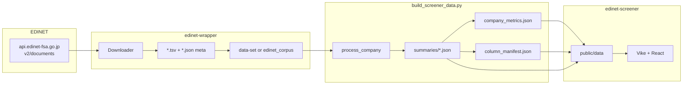

# データ取得から表示・計算まで（コード準拠）

このドキュメントは **本リポジトリの実装に沿って**、EDINET からの取得から `public/data` の生成、指標の算出式、フロントでの表示換算までを整理する。運用手順の詳細は既存ドキュメントへリンクする。

**関連ドキュメント（運用・構成）**

- [METRICS_UI_AND_DB_GAP.md](./METRICS_UI_AND_DB_GAP.md) — 列 ID・表示名・`company_metrics` キー・DB にあって UI に出ないものの対応表
- [PROJECT_FLOW.md](./PROJECT_FLOW.md) — 全体フローとディレクトリ関係
- [edinet-wrapper/docs/LOCAL_EDINET_CORPUS.md](../edinet-wrapper/docs/LOCAL_EDINET_CORPUS.md) — コーパス取得を GHA と同様にローカルで行う手順
- [edinet-screener/docs/SAMPLE_DATA_COMMANDS.md](../edinet-screener/docs/SAMPLE_DATA_COMMANDS.md) — ビルドコマンド例

---

## 1. スコープと用語

| 用語 | 意味 |
|------|------|
| **静的 JSON 運用** | バックエンド API なし。`edinet-screener/public/data/` の JSON をビルド時またはクライアント `fetch` で読む。 |
| **`doc_type`** | ラッパー内の書類区分文字列: `annual`, `quarterly`, `semiannual`, `*_amended`, `large_holding*` 等。 |
| **`periods`** | 1 企業の `summaries/{secCode}.json` に含まれる配列。各要素は 1 開示書類（有報・四半・半期など）1 本分のフラット化された PL/BS/CF/Summary。 |
| **`company_metrics`** | `company_metrics.json` の `metrics` 配列の 1 行。一覧テーブル・分析ページの「指標カード」用。主に **最新 `periods` 要素**から組み立てる。 |

**方針**: J-Quants は使わない。株価連動の一部（PER 等）は EDINET 開示テキストにあれば採用し、無ければ欠損。

---

## 2. エンドツーエンドのワークフロー

1. EDINET API で書類一覧取得 → 書類 ID ごとに TSV（type=5）等をダウンロード。
2. 取得物をリポジトリの **`data-set/`**（既定）などに配置。
3. **`edinet-wrapper/scripts/frontend/build_screener_data.py`** が `data-set` を走査し `public/data` を生成。
4. フロントは **`/data/company_metrics.json`**、**`/data/summaries/{secCode}.json`**、必要に応じ **`/data/raw_tsv/...`** を `fetch` して表示（SSR 専用の集約 API はなし）。**`column_manifest.json`** と **`companies.json`** も `public/data` に書き出されるが、**現行の `.ts`/`.tsx` からは読んでいない**（列 UI は [`ColumnVisibilityContext.tsx`](../edinet-screener/components/ColumnVisibilityContext.tsx) のハードコードが実態。企業名・コードは `company_metrics` の各行に含まれる）。

---

## 3. データ取得（コードベース）

### 3.1 API クライアント

**参照**: [`edinet-wrapper/src/edinet_wrapper/downloader.py`](../edinet-wrapper/src/edinet_wrapper/downloader.py)

| 項目 | 内容 |
|------|------|
| 一覧 URL | `https://api.edinet-fsa.go.jp/api/v2/documents.json`（`date`, `type`, `Subscription-Key`） |
| 書類本体 | `https://api.edinet-fsa.go.jp/api/v2/documents/{docID}` に `type` 指定（TSV は **5**、PDF は 2、XBRL zip は 1） |
| 認証 | 環境変数 **`EDINET_API_KEY`**（`.env` 可。値は `strip()` して末尾改行を除去） |
| 待機 | 成功リクエスト間 **`EDINET_REQUEST_DELAY`** 秒（未設定時 3.0） |
| リトライ | `get_response` で HTTP 非 200 や非 JSON 時に最大 5 回、間隔 60 秒 |

### 3.2 書類種別コード（docTypeCode）と `doc_type`

`DOC_TYPE_CODE_MAP`（コメントに仕様 PDF への参照あり）:

| docTypeCode | doc_type | 日本語のイメージ |
|-------------|----------|------------------|
| 120 | `annual` | 有価証券報告書 |
| 130 | `annual_amended` | 訂正有価証券報告書 |
| 140 | `quarterly` | 四半期報告書 |
| 150 | `quarterly_amended` | 訂正四半期報告書 |
| 160 | `semiannual` | 半期報告書 |
| 170 | `semiannual_amended` | 訂正半期報告書 |
| 350 / 360 | `large_holding` / `*_amended` | 大量保有報告書（府令060） |

`docTypeCode` がマップに無い場合は **`ordinanceCode` + `formCode`** から `get_doc_type` で推定（例: `010` + `030000` → `annual`、`043000` → `quarterly`、`043A00` → `semiannual`）。

**重要**: 四半期・半期の数値は **有価証券報告書からの派生ではなく**、それぞれ **四半期報告書・半期報告書の TSV** がソースである（別 `docID`・別 `periods` 要素）。

### 3.3 実行スクリプトの役割

| スクリプト | 用途 |
|------------|------|
| [`scripts/download/download_company_10years.py`](../edinet-wrapper/scripts/download/download_company_10years.py) | 指定 EDINET コードについて日付窓で一覧取得し、複数 `doc_types`（既定は年次・四半・半期・大量保有・訂正系すべて）をダウンロード。`--file_type tsv` が典型。 |
| [`scripts/download/prepare_edinet_corpus.py`](../edinet-wrapper/scripts/download/prepare_edinet_corpus.py) | `--start_date` / `--end_date` と `--doc_type` でコーパス取得。 |
| [`scripts/download/edinet_corpus.sh`](../edinet-wrapper/scripts/download/edinet_corpus.sh) | 月単位などシェルから `prepare_edinet_corpus.py` を呼ぶ。 |
| [`scripts/download/edinet_fetch_one_day.sh`](../edinet-wrapper/scripts/download/edinet_fetch_one_day.sh) | 提出日 1 日分を複数 `doc_type` で順に取得（`EDINET_ONE_DAY_DOC_TYPES` で上書き可）。 |

GitHub Actions での月次コーパス運用は [LOCAL_EDINET_CORPUS.md](../edinet-wrapper/docs/LOCAL_EDINET_CORPUS.md) を参照。

### 3.4 取得物のファイル

各書類について通常:

- **`{docID}.tsv`** — API 応答は zip 内の **`XBRL_TO_CSV/jpcrp*.csv`** を抽出し、**`{docID}.tsv` として保存**する実装（[`_download_document_in_tsv`](../edinet-wrapper/src/edinet_wrapper/downloader.py)）。中身はタブ区切り・**UTF-16**（パーサと一致）。
- **`{docID}.json`** — 書類メタ（`periodStart`, `periodEnd`, `docDescription`, `docID`, `submitDateTime`, `secCode`, `filerName` 等）。`build_screener_data` が `collect_tsv_paths` で TSV とペアにする。

---

## 4. `data-set` の発見と期間の並び

**参照**: [`edinet-wrapper/scripts/frontend/build_screener_data.py`](../edinet-wrapper/scripts/frontend/build_screener_data.py)

### 4.1 `discover_edinet_codes`

- `data_set_root.rglob("*.tsv")` を走査し、パス中の **`E` + 5 桁数字** を EDINET コードとしてユニーク収集。
- `--mode full` 時に「全社」リストの根拠になる。

### 4.2 `collect_tsv_paths`

- パスに `/{edinet_code}/` が含まれる全 TSV を列挙し、同名の `.json` が存在するものだけ `(tsv, json)` ペアにする。
- **ソートキー**: メタ JSON の **`periodEnd`**（文字列として昇順）。
- よって `summaries` の `periods` は **期末日の昇順**。同一期末が複数書類であっても、そのまま複数要素になり得る（フロント側で後述のデデュープあり）。

---

## 5. TSV パース（数値の素データ）

**参照**: [`edinet-wrapper/src/edinet_wrapper/parser.py`](../edinet-wrapper/src/edinet_wrapper/parser.py)

### 5.1 処理の流れ

1. `pl.read_csv(..., separator="\t", encoding="utf-16", infer_schema_length=0)` で TSV 読込。
2. `Parser.unique_element_list` で（要素 ID, コンテキスト ID, 相対年度, 連結・個別, 期間・時点）単位にユニーク化。
3. シート定義 `META`, `SUMMARY`, `TEXT`, `BS`, `PL`, `CF` の各 **葉要素**について:
   - `filter_by_element_id` → `filter_by_consolidation`（個別・非連結を除外）
   - `filter_by_year` + `to_dict` で `YEAR_LIST` に沿ったネスト dict を構築。

### 5.2 連結のみ採用

- `META` の **`連結決算の有無`** が文字列 `"false"` のとき、**`parse_tsv` は `None` を返す**（その書類は `process_company` でスキップされうる）。

### 5.3 `YEAR_LIST`（パーサ）

`Prior4Year` … `CurrentYear`, `Prior1YTD`, `CurrentYTD`, `Prior1Quarter`, `CurrentQuarter`, `Prior1Interim`, `Interim`, `FilingDate` など。四半・半期・IFRS 中間期のコンテキストに対応。

---

## 6. フラット化と「1 期」の値の取り出し

**参照**: [`build_screener_data.py`](../edinet-wrapper/scripts/frontend/build_screener_data.py) の `CURRENT_KEYS`, `_YEAR_BUCKET_KEYS`, `_get_current_value`, `_flatten_for_period`

### 6.1 `_flatten_for_period`

- `FinancialData` の `summary` / `pl` / `bs` / `cf` はネスト dict（項目名 → 年度バケット別の値）。
- 再帰的に走査し、**葉に到達したら** `_get_current_value` で 1 文字列に潰して、キーを **`"親キー / 子キー"`** 形式のフラットキーにする（TSV の全項目を欠かさない方針。値が無い場合は JSON では `null`）。

### 6.2 `_get_current_value` の優先順位

ネストの末端 dict に対し、次のキーを **この順**で探し、最初に非空の値を返す。

1. `CurrentQuarter`
2. `CurrentYTD`
3. `CurrentYear`
4. `Prior1Quarter`
5. `Prior1YTD`
6. `Interim`
7. `Prior1Interim`
8. 上記以外の値のうち **先頭の非空**

これにより、四半報告では `CurrentQuarter`、年次では `CurrentYear` 等が自動的に選ばれる。

---

## 7. `summaries/{secCode}.json`

**参照**: `process_company`, `run_sample` in [`build_screener_data.py`](../edinet-wrapper/scripts/frontend/build_screener_data.py)

### 7.1 トップレベル

- `edinetCode`, `secCode`, `filerName`
- **`periods`**: 上記フラット化結果の配列。各要素に `periodStart`, `periodEnd`, `docID`, `docDescription`, `submitDateTime`, `summary`, `pl`, `bs`, `cf`, 任意で `rawTsvPath`

### 7.2 `rawTsvPath` / `raw_tsv/`

- 既定では `include_raw_tsv=True`。TSV 全文を JSON 配列化し `public/data/raw_tsv/{secCode}/{docID}.json` に保存し、`rawTsvPath` に相対パスを記録。
- `--no_raw_tsv` で無効化可能。

### 7.3 ビルド副産物

- **`write_data_quality_reports`**: `data_quality_report.json` / `.md`（列・企業別の欠損集計）。`--strict` 時は重要列が全社欠損なら exit 1。
- **`write_all_keys_reports`**: `all_keys_report.json` / `.md`（サンプル時デフォルトで各社・各期のキー集合をダンプ）。`--mode full` ではデフォルト無効。

---

## 8. `company_metrics.json` の 1 行（`summary_to_metrics_row`）

**参照**: [`summary_to_metrics_row`](../edinet-wrapper/scripts/frontend/build_screener_data.py) および同ファイル内のヘルパー関数。

### 8.1 共通の前提

| 項目 | ルール |
|------|--------|
| **最新期** | `periods[-1]`（`periodEnd` 昇順ソート済みの最後の要素）。 |
| **集約用 summary** | `latest = periods[-1]` の `summary` を `_merge_edinet_valuation_from_older_periods(..., periods)` に通した dict を **`s`** とする。 |
| **PL/BS/CF** | 原則 **最新期のみ**（`latest` の `pl`, `bs`, `cf`）。例外は下記の開示値フォールバック。 |
| **数値パース** | `_parse_number`: カンマ除去、`"－"` は `None`。 |

### 8.2 開示値のフォールバック（summary 横断）

キー: `株価収益率`, `自己資本利益率、経営指標等`, `１株当たり純資産額`, `配当性向`, `１株当たり配当額`, `１株当たり中間配当額`

- 最新期の `summary` に値が無い場合、**`periods` を `reversed(periods)` で走査**（`collect_tsv_paths` により `periods` は `periodEnd` 昇順なので、**期末日が新しい要素から順**）。各キーごとに最初に見つかった値を代入。
- 用途: 最新行の summary に PER 等が無いとき、**より期末の新しい過去の期**から埋める。走査順は期末ベースであり **「有報に限定」されていない**（キーによっては四半の summary に値がある場合もある）。**キー単位で別 `periodEnd` の値を合成**し得る。

### 8.3 売上高（一覧用）

**`_pick_sales_line(s, pl)`** の順:

1. `summary["売上高"]`
2. `summary["売上収益（IFRS）"]`
3. `pl["売上高"]`
4. `pl["売上収益（IFRS）"]`  
いずれも `_has_value`（空・`－` は無効）で判定。

### 8.4 開示からそのまま載せる主なフィールド

（キーは JSON のフィールド名／開示ラベルに依存）

| JSON キー | 主なソース（`s` / `pl` / `bs` / `cf`） |
|-----------|----------------------------------------|
| `自己資本比率` | `s` |
| `EPS` | `s["１株当たり当期純利益又は当期純損失"]` |
| `dilutedEPS` | `s["潜在株式調整後１株当たり当期純利益"]`（無効文字は除外ロジックあり） |
| `経常利益` | `s` |
| `当期純利益` | `pl` または `s` の親会社帰属当期純利益系 |
| `純資産額` / `総資産額` / `包括利益` | `s` |
| `BPS` | `s["１株当たり純資産額"]` |
| `ROE` | `s["自己資本利益率、経営指標等"]` |
| `営業利益` | `pl` |
| `営業CF` / `投資CF` | `s` または `cf` の営業・投資キャッシュフロー系 |
| `財務CF` | `s` または `cf` |
| `現金残高` | `s` または `cf` |
| `配当性向` | `s` |
| `dividendPerShare` | `s` の DPS 系 |
| `発行済株式総数` | `s["発行済株式総数（普通株式）"]` |
| `流動資産` / `流動負債` / `負債` / `投資有価証券` | `bs` |
| `PER` | `s["株価収益率"]` を数値化（`"－"` は null） |
| `PBR` / `時価総額` | 現状 **`None` 固定**（列用のプレースホルダ） |
| `売上高` | `_pick_sales_line` の結果 |

### 8.5 計算フィールド（式）

以下、**JSON に入る値の型**に注意（比率の多くは **小数文字列**、YoY/CAGR は `_format_ratio_decimal` で文字列化）。

#### `roeCalculated`（文字列、比率小数）

\[
\text{roeCalculated} = \text{formatRatioDecimal}\left(\frac{\text{NI}}{\text{NA}}\right)
\]

- NI: `当期純利益` 行の組み立てと同じロジック（親会社帰属当期純利益などから取得）
- NA: `s["純資産額"]`  
NA=0 または NI/NA 欠損時は `None`。

#### `roa`（文字列、比率小数）

\[
\text{roa} = \text{formatRatioDecimal}\left(\frac{\text{NI}}{\text{TA}}\right)
\]

- TA: `s["総資産額"]`

#### `equityRatioCalculated`（文字列、比率小数）

\[
\text{equityRatioCalculated} = \text{formatRatioDecimal}\left(\frac{\text{NA}}{\text{TA}}\right)
\]

#### `fcf`（文字列、円ベースのおおよそ整数表現）

\[
\text{fcf} = \text{OCF} + \text{ICF}
\]

- OCF / ICF は `営業CF` / `投資CF` の行と同じキー解決。両方数値化できたときのみ。合計が整数に近ければ `int` 文字列、そうでなければ float 文字列。

#### `payoutRatioComputed`（文字列、比率小数）

\[
r = \frac{\text{DPS}}{\text{EPS}}
\]

- DPS/EPS は `_parse_number`。EPS=0 または片方欠損で `None`。
- **`r > 2.0`（200%超）なら `None`**（異常値扱い）。

#### `配当利回り`（**数値、単位はパーセント**）

`_compute_dividend_yield_pct(dps, eps, per)`:

- 暗黙株価: \(\text{price} = \text{EPS} \times \text{PER}\)（PER は開示の株価収益率を数値化したもの）
- \(\text{yield\%} = (\text{DPS} / \text{price}) \times 100\)
- 除外条件: DPS/EPS/PER 欠損、EPS≤0、PER≤0、`DPS/EPS > 2`、**yield > 10%** → `None`

#### `ネットキャッシュ`（整数または null）

実装: `int(_parse_number(CA) + (_parse_number(INV) or 0) * 0.7 - _parse_number(LIAB))`（[`_net_cash`](../edinet-wrapper/scripts/frontend/build_screener_data.py)）。Python の **`int()` は 0 方向への切り捨て**（床関数とは負数で一致しない場合あり）。

- CA: `流動資産`、INV: `投資有価証券`（欠損時 0）、LIAB: `負債`  
CA または LIAB が欠損なら `None`。

#### 成長率・CAGR（**文字列、小数比率** 例: `0.15` = 15%）

**対象期間**: `_annual_periods(periods)` — `docDescription` に **「有価証券報告書」**を含み、**「四半期」「半期」**を含まない期だけ。同一 `periodEnd` は初出のみ。

| フィールド | 計算 |
|-------------|------|
| `salesGrowthYoY` | `_yoy_growth(current, prior)` = `(current − prior) / abs(prior)`。売上は **`_annual_sales`** のみ使用: `summary["売上高"]` → `summary["売上収益（IFRS）"]` → **`pl["売上高"]` のみ**（**`pl["売上収益（IFRS）"]` はここでは見ない**）。一覧用の **`_pick_sales_line` より PL 側 IFRS が弱い**ので、IFRS 売上のみ PL に載る銘柄では YoY/CAGR が欠損しうる。 |
| `opGrowthYoY` | 営業利益の YoY |
| `epsGrowthYoY` | EPS（summary の１株当たり当期純利益）の YoY |
| `dividendGrowthYoY` | DPS（１株当たり配当額 or 中間配当額）の YoY |
| `salesCagr3y` | `_cagr(sales_{t-3}, sales_t, 3)` — **両端とも正のときのみ** \((end/start)^{1/3}-1\) |
| `salesCagr5y` | 同上 5 年（`annual[-6]` と最新） |

`_yoy_growth`: prior が `None` または **0** なら `None`。

#### `consecutiveDivIncreases`（整数）

- 年次（`_annual_periods`）を**最新から古へ**辿り、**`summary["１株当たり配当額"]` のみ**を数値化（**`１株当たり中間配当額` は未使用**。欠損年が出たらその時点で連鎖終了）。隣接する年について **新しい年の DPS > 1 年古い年の DPS** の連続回数を数える（[`_consecutive_div_increases`](../edinet-wrapper/scripts/frontend/build_screener_data.py)）。

#### `currentRatio`（数値、四捨五入 4 桁）

\[
\text{CR} = \frac{\text{流動資産}}{\text{流動負債}}
\]

流動負債=0 は `None`。

#### `deRatio`（数値、四捨五入 4 桁）

\[
\text{D/E} = \frac{\text{負債}}{\text{純資産額}}
\]

純資産=0 は `None`。

#### `roic`（数値、小数 6 桁）

`_compute_roic(op, total_assets, current_liabilities, tax_expense, pre_tax_income)`:

- 投下資本: \(\text{invested} = \text{TA} - \text{CL}\)（流動負債）。`invested <= 0` なら `None`。
- 実効税率: `tax` と `pretax` が取れて `pretax > 0` なら \(\min(\max(\text{tax}/\text{pretax},0),1)\)、**さもなければ 0.3 固定**。
- \(\text{NOPAT} = \text{OP} \times (1 - \text{tax\_rate})\)
- \(\text{ROIC} = \text{NOPAT} / \text{invested}\)（round 6 桁）

OP は `営業利益`、TA は `s["総資産額"]` または `bs["総資産"]`、税引前利益は `税引前利益` / `税金等調整前当期純利益` / `経常利益` のいずれか。

#### `piotroskiFScore`（0〜9 の整数または null）

前年の年次（`_annual_periods` の直前の有報）が無ければ `None`。

各 1 点（条件を満たせば +1）:

1. 当期純利益 > 0  
2. 営業 CF > 0  
3. 当期 ROA > 前年 ROA（純利益/総資産）  
4. 営業 CF > 当期純利益（アクルーアル）  
5. 負債/総資産 が前年より減少  
6. 流動比率が前年より上昇  
7. 発行済株式数が前年以下（希薄化なし）  
8. 売上総利益率（売上総利益÷売上）が前年より上昇  
9. 総資産回転率（売上÷総資産）が前年より上昇  

使用するキーはコード内 `_g` のフォールバック列挙に従う（IFRS/JP の売上・純利益の複数キー）。

### 8.6 メタ列

| フィールド | 内容 |
|------------|------|
| `計算日` | 最新期の `periodEnd` |
| `決算月` | `periodEnd` の `YYYY-MM-DD` の **MM** 部分 |

### 8.7 CLI 再生成

- **`--metrics_only`**: 既存 `summaries/*.json` だけ読み直し `company_metrics.json` と品質レポートを更新（`data-set` 不要）。

---

## 9. 列定義とマニフェスト

**参照**: [`edinet-wrapper/config/screener_columns.json`](../edinet-wrapper/config/screener_columns.json), `write_column_manifest` in [`build_screener_data.py`](../edinet-wrapper/scripts/frontend/build_screener_data.py)

- テーブル列のラベル・ID のソース（リポジトリ正）は **`screener_columns.json`**。
- ビルド時に **`public/data/column_manifest.json`** へ `version`, `generatedFrom`, `columns` を書き出す（外部ツール・人手確認用）。**ランタイムの列表示は `ColumnVisibilityContext` の `COLUMN_CONFIG` が実態**で、マニフェストは **`fetch` していない**（[`METRICS_UI_AND_DB_GAP.md`](./METRICS_UI_AND_DB_GAP.md) §2）。

---

## 10. フロントエンド — データ取得と表示

### 10.1 読み込み

| 画面 / コンポーネント | エンドポイント |
|------------------------|----------------|
| [`CompanyTable.tsx`](../edinet-screener/components/CompanyTable.tsx) | `GET /data/company_metrics.json` |
| [`CompanySidebar.tsx`](../edinet-screener/components/CompanySidebar.tsx) | 同上 |
| [`pages/analyze/@secCode/+Page.tsx`](../edinet-screener/pages/analyze/@secCode/+Page.tsx) | `GET /data/summaries/{secCode}.json` と `GET /data/company_metrics.json`（指標カード用） |
| [`TableDownloadButton.tsx`](../edinet-screener/components/TableDownloadButton.tsx) | 同上 |
| [`MajorShareholdersTimeSeries.tsx`](../edinet-screener/components/MajorShareholdersTimeSeries.tsx) | `summaries` の `rawTsvPath` が **`raw_tsv/` で始まる**とき `GET /data/{rawTsvPath}`（DB 由来 JSON では [`normalize_public_raw_tsv_path`](../edinet-wrapper/scripts/pipeline/db_common.py) により **`raw_tsv/` 接頭辞でないパスは `null`** になり得る） |

**未使用（ビルドでは生成）**: `GET /data/companies.json`、`GET /data/column_manifest.json` — 現行コードパスからは呼ばれない。

### 10.2 分析ページ: `CompanySummary` の正規化

**参照**: [`edinet-screener/pages/analyze/@secCode/companyData.ts`](../edinet-screener/pages/analyze/@secCode/companyData.ts)

- **`dedupePeriodsByPeriodEndAndDoc`**: キー `periodEnd + docID` ごとに **`submitDateTime` が新しい方のみ残す**。その後 `periodEnd` 昇順、`submitDateTime` 昇順でソート。
- 欠損 JSON 時は例外（「形式が不正」）。

### 10.3 一覧テーブル: 金額・比率の表示

**参照**: [`CompanyTable.tsx`](../edinet-screener/components/CompanyTable.tsx)

| 関数 | 挙動 |
|------|------|
| **`formatSales(s)`** | 文字列を `parseFloat` し **÷ 1_000_000**（円 → **百万円**）。小数桁は最大 0（`toLocaleString`）。欠損は `－`。 |
| **`formatRatio(s)`** | 文字列を `parseFloat` し **× 100** して **`xx.xx%`**。現行の `company_metrics` では **ROE・自己資本比率・配当性向・YoY/CAGR 等が小数文字列**（例: `"0.114"`）で入っており整合する。**開示がすでにパーセント表記の文字列**だと二重に 100 倍になるため、この列では **小数比率前提**（データ生成側の責務）。 |

**`getCellValue`**: 列 ID ごとに `CompanyMetric` のフィールドを選択（例: `salesGrowthYoY` → `formatRatio`）。数値型フィールド（`currentRatio`, `deRatio`, `roic`, `piotroskiFScore` 等）は個別に `toFixed` や `%` 表示。

### 10.4 分析ページ: PL/BS/CF テーブル（百万円表示）

**参照**: [`+Page.tsx`](../edinet-screener/pages/analyze/@secCode/+Page.tsx) の `formatMillionYenCell`

1. 空・`－` は `－`。
2. カンマ除去後 `parseFloat`。
3. **小数点を含み、かつ `|n| < 1_000_000`** のとき: **比率・EPS 等**とみなし、**百万円換算せず** `toLocaleString("ja-JP", { maximumFractionDigits: 4 })`。
4. それ以外: **`n / 1_000_000`** を `maximumFractionDigits: 2` で表示（**百万円**）。

表ヘッダに単位注記（`unitCaption`）を出す。

### 10.5 チャート（Recharts）

**参照**: [`SummaryCharts.tsx`](../edinet-screener/components/SummaryCharts.tsx), [`financialPickers.ts`](../edinet-screener/lib/financialPickers.ts)

共通:

- **`parseIntYen(raw)`**: カンマ除去のうえ **`parseInt`**（整数円前提）。`－` は null。
- **`toMillionsYen(yen)`**: `yen / 1_000_000`。
- ツールチップ: 値は **百万円**表記（`maximumFractionDigits: 1`）。

| チャート | データソース | 備考 |
|----------|--------------|------|
| 売上高の推移 | `pickSummaryRevenueForChart` → summary の `売上高` または `売上収益（IFRS）` | |
| 配当キャッシュアウト | `pickCfDividendPaid` → CF の `配当金の支払額` または IFRS 版 | グラフでは **`Math.abs`** |
| PL 系 | `pickPlRevenueForChart`, `営業利益`, `pickPlNetIncome`（親会社帰属系の複数キーを順に試す） | |
| BS 系 | `総資産`, `負債`, `純資産` | |

### 10.6 指標テーブル（分析ページ）の型別表示

**参照**: [`IndicatorsTable` in `+Page.tsx`](../edinet-screener/pages/analyze/@secCode/+Page.tsx)

- **`roic`**: 既に数値なら **`×100` + `%`**（内部は比率小数）。
- **`ROE`, `自己資本比率`, `配当性向`, `roeCalculated`, `roa`, …, `salesCagr5y`**: **文字列**の場合 `parseFloat` して **`×100` + `%`**（= `company_metrics` 側の小数比率と整合）。
- **`ネットキャッシュ比率`**: 数値を `×100` + `%`。
- **`時価総額` / `ネットキャッシュ`**: 絶対値が大きいとき `formatNum`（K/M/B サフィックス）。

---

## 11. DB パイプライン（本線から独立）

**参照**: [`edinet-wrapper/scripts/pipeline/ingest_daily_edinet_to_db.py`](../edinet-wrapper/scripts/pipeline/ingest_daily_edinet_to_db.py)

- 日次で EDINET を取り込み SQLite/D1 等へ格納する **別経路**。静的 `public/data` 生成の **必須ステップではない**。
- 運用・ハイブリッド構成は [D1_HYBRID_OPERATIONS.md](./D1_HYBRID_OPERATIONS.md) を参照。

---

## 12. 変更時の注意（メンテナ用）

- **指標の定義を変えたら**: `summary_to_metrics_row` と本書の **第 8 章**を同期する。
- **表示単位を変えたら**: `formatSales` / `formatMillionYenCell` / `SummaryCharts` の百万円換算と本書 **第 10 章**を同期する。
- **新しい EDINET 書類種別を扱う場合**: `Downloader.DOC_TYPE_CODE_MAP` と `get_doc_type`、ダウンロードスクリプトの `choices` を確認。

---

*生成物のコマンド例は [SAMPLE_DATA_COMMANDS.md](../edinet-screener/docs/SAMPLE_DATA_COMMANDS.md) を参照。*
