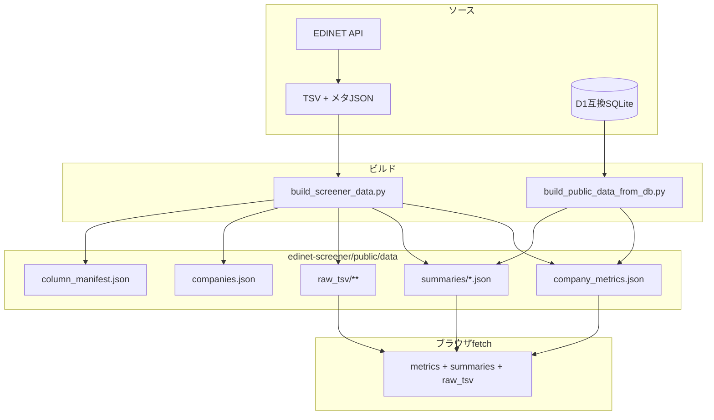

# 指標・UI 表示名・DB ギャップ一覧

本書は **実装とスキーマを根拠に**、スクリーナー／企業詳細で使うパラメータ、画面表示名、データの出所・計算、および **D1 互換 DB にあってフロント静的データに載らないもの** を整理する。

**計算式の詳細**（YoY、ROIC、F-Score 等）は [DATA_PIPELINE_AND_CALCULATIONS.md](./DATA_PIPELINE_AND_CALCULATIONS.md) を正とする。本書は **どの UI がどの JSON キーを読むか** に主眼を置く。

**関連**: [D1_HYBRID_OPERATIONS.md](./D1_HYBRID_OPERATIONS.md)（D1 運用）、[`edinet-wrapper/sql/d1_schema.sql`](../edinet-wrapper/sql/d1_schema.sql)（DDL）

---

## 1. データ経路（静的 JSON と DB）

- **ランタイムのフロント**は **D1/SQLite に接続しない**。現行コードが `fetch` するのは主に **`/data/company_metrics.json`**、**`/data/summaries/{secCode}.json`**、大株主用の **`/data/raw_tsv/...`**（[`MajorShareholdersTimeSeries`](../edinet-screener/components/MajorShareholdersTimeSeries.tsx)）。**`companies.json` と `column_manifest.json` は `public/data` に出力されるが、`.ts`/`.tsx` からは読んでいない**（企業名・コードは `company_metrics` 各行に含まれる。列 UI は [`ColumnVisibilityContext`](../edinet-screener/components/ColumnVisibilityContext.tsx) のハードコードが実態）。
- **DB → JSON** は [`build_public_data_from_db.py`](../edinet-wrapper/scripts/pipeline/build_public_data_from_db.py) が **`period_financials` INNER JOIN `documents`** のみ読み、`summary_to_metrics_row` で `company_metrics` を再生成する経路がある（[`D1_HYBRID_OPERATIONS.md`](./D1_HYBRID_OPERATIONS.md)）。

---

## 2. 表示名の「正」と二重定義の注意

| 役割 | ファイル |
|------|----------|
| 列 ID・ラベル・`metricsKey` の定義源（リポジトリ正） | [`edinet-wrapper/config/screener_columns.json`](../edinet-wrapper/config/screener_columns.json) |
| ビルド成果物（参照用・外部ツール向け） | [`column_manifest.json`](../edinet-screener/public/data/column_manifest.json)（**ランタイムでは未 `fetch`**） |
| 一覧テーブル実装（表示・ソート） | [`edinet-screener/components/CompanyTable.tsx`](../edinet-screener/components/CompanyTable.tsx) |
| 列の表示／非表示 UI（ランタイムの真実） | [`ColumnVisibilityContext.tsx`](../edinet-screener/components/ColumnVisibilityContext.tsx) の `COLUMN_CONFIG`（**`screener_columns.json` と同一内容をハードコード**） |

**メンテナンス**: 列追加・ラベル変更時は **`screener_columns.json` と `ColumnVisibilityContext.tsx` を必ず同期**。`column_manifest.json` はビルドで上書きされるが、**現状アプリは読まない**。

---

## 3. 表 A: スクリーナー列（一覧・CSV）

**`company_metrics.json` の 1 行**は [`summary_to_metrics_row`](../edinet-wrapper/scripts/frontend/build_screener_data.py) が生成する。下表の「生成」列は同関数および `_merge_edinet_valuation_from_older_periods` 前提の **`s` / `pl` / `bs` / `cf`**（最新 `periods[-1]`、補完済み summary）を指す。

**一覧の数値表示**: 金額系は主に `formatSales`（円 ÷ 10^6 → **百万円**、小数桁 0）。比率文字列は `formatRatio`（×100 + `%`）。**ROIC** は数値として ×100 + `%`。

**CSV エクスポート**: [`TableDownloadButton.tsx`](../edinet-screener/components/TableDownloadButton.tsx) の `getCellValueForExport`。**成長率・流動比率・D/E・ROIC・F-Score 等の列は `switch` に無く `default` で「－」になる**（一覧とは表示が一致しない）。実装上のギャップとして知ること。

| column_id | 画面表示名 | `company_metrics` キー | 生成ロジック（要約） | 詳細 |
|-----------|------------|--------------------------|----------------------|------|
| filerName | 会社名* | `filerName` | メタの提出者名 | `process_company` で JSON メタから |
| secCode | 銘柄コード* | `secCode` | メタの証券コード（正規化） | 同上 |
| edinetCode | EDINETコード | `edinetCode` | 引数の EDINET コード | 同上 |
| calcDate | 計算日 | `計算日` | 最新期 `periodEnd` | `summary_to_metrics_row` |
| fiscalMonth | 決算月 | `決算月` | `periodEnd` の月部分 | 同上 |
| PBR | PBR | `PBR` | **常に `null`** | 列のみ定義 |
| PER | PER | `PER` | `s`「株価収益率」（補完あり）数値化 | DATA_PIPELINE §8 |
| payoutRatio | 配当性向 | `配当性向` | 開示 `s` | 同上 |
| payoutRatioComputed | 配当性向（算出） | `payoutRatioComputed` | DPS÷EPS（上限で null） | `_compute_payout_ratio_dps_eps` |
| dividendYield | 配当利回り | `配当利回り` | EPS×PER 暗黙株価から算出（% 数値） | `_compute_dividend_yield_pct` |
| marketCap | 時価総額 | `時価総額` | **常に `null`** | 列のみ定義 |
| netCash | ネットキャッシュ | `ネットキャッシュ` | 流動資産 + 投資有価証券×0.7 − 負債 | `_net_cash` |
| netCashRatio | ネットキャッシュ比率 | `ネットキャッシュ比率` | **常に `null`** | ビルド固定 |
| EPS | EPS | `EPS` | `s`「１株当たり当期純利益又は当期純損失」 | 補完あり |
| dilutedEPS | 希薄化EPS | `dilutedEPS` | `s` 潜在希薄化 EPS | 同上 |
| ROE | ROE | `ROE` | `s`「自己資本利益率、経営指標等」 | 補完あり |
| roeCalculated | ROE（算出） | `roeCalculated` | 純利益÷純資産 | `_compute_roe_calculated` |
| roa | ROA | `roa` | 純利益÷総資産 | `_compute_roa` |
| equityRatio | 自己資本比率 | `自己資本比率` | 開示 `s` | 補完あり |
| equityRatioCalculated | 自己資本比率（算出） | `equityRatioCalculated` | 純資産÷総資産 | `_compute_equity_ratio_calculated` |
| BPS | BPS | `BPS` | `s`「１株当たり純資産額」 | 補完あり |
| dividendPerShare | 1株当たり配当金 | `dividendPerShare` | `s` DPS／中間配当 | `dps_raw` |
| sharesOutstanding | 発行済株式総数 | `発行済株式総数` | `s`「発行済株式総数（普通株式）」 | — |
| sales | 売上高 | `売上高` | `_pick_sales_line(s, pl)` | JP→IFRS summary→PL |
| operatingProfit | 営業利益 | `営業利益` | `pl`「営業利益」 | — |
| recurringProfit | 経常利益 | `経常利益` | `s`「経常利益」 | — |
| operatingProfitRatio | 営業利益率 | （行に無い） | **フロントのみ** `営業利益÷売上高×100%` | `CompanyTable` / `TableDownloadButton` |
| netIncome | 当期純利益 | `当期純利益` | `pl`→`s` の親会社帰属純利益系 | `summary_to_metrics_row` |
| netProfitRatio | 純利益率 | （行に無い） | **フロントのみ** `当期純利益÷売上高×100%` | 同上 |
| comprehensiveIncome | 包括利益 | `包括利益` | `s` | — |
| liabilities | 負債 | `負債` | `bs`「負債」 | — |
| currentLiabilities | 流動負債 | `流動負債` | `bs` | — |
| currentAssets | 流動資産 | `流動資産` | `bs` | — |
| netAssets | 純資産額 | `純資産額` | `s` | — |
| totalAssets | 総資産額 | `総資産額` | `s` | — |
| investmentSecurities | 投資有価証券 | `投資有価証券` | `bs` | — |
| cashBalance | 現金及び現金同等物 | `現金残高` | `s` または `cf` | キーは JSON 上 `現金残高` |
| operatingCF | 営業CF | `営業CF` | `s` または `cf` | — |
| investingCF | 投資CF | `投資CF` | `s` または `cf` | — |
| fcf | FCF | `fcf` | 営業CF + 投資CF | `_compute_fcf` |
| financingCF | 財務CF | `財務CF` | `s` または `cf` | — |
| salesGrowthYoY | 売上高成長率(YoY) | `salesGrowthYoY` | 有報のみ `_annual_sales` YoY | DATA_PIPELINE §8（`_annual_sales` は PL IFRS 売上未使用に注意） |
| opGrowthYoY | 営業利益成長率(YoY) | `opGrowthYoY` | 有報 YoY | — |
| epsGrowthYoY | EPS成長率(YoY) | `epsGrowthYoY` | 有報 YoY | — |
| dividendGrowthYoY | 配当成長率(YoY) | `dividendGrowthYoY` | 有報 DPS YoY | `_annual_dps` |
| salesCagr3y | 売上高CAGR(3年) | `salesCagr3y` | 有報 CAGR | `_cagr` |
| salesCagr5y | 売上高CAGR(5年) | `salesCagr5y` | 同上 | — |
| consecutiveDivIncreases | 連続増配年数 | `consecutiveDivIncreases` | 有報で「１株当たり配当額」のみ連増 | `_consecutive_div_increases` |
| currentRatio | 流動比率 | `currentRatio` | 流動資産÷流動負債 | `_compute_current_ratio` |
| deRatio | D/Eレシオ | `deRatio` | 負債÷純資産 | `_compute_de_ratio` |
| roic | ROIC | `roic` | NOPAT÷(総資産−流動負債) | `_compute_roic` |
| piotroskiFScore | Piotroski F-Score | `piotroskiFScore` | 9 項目スコア | `_piotroski_f_score` |

---

## 4. 表 B: 企業詳細「指標」タブ

**実装**: [`edinet-screener/pages/analyze/@secCode/+Page.tsx`](../edinet-screener/pages/analyze/@secCode/+Page.tsx) の `INDICATOR_KEYS`（`label` が左列の表示名）。データは **`company_metrics.json` から `secCode` 一致の 1 行`**（一覧と同じ JSON）。

| 表示名（UI） | `CompanyMetricsRow` キー | 表 A との関係 |
|--------------|---------------------------|----------------|
| 計算日 | `計算日` | 一覧の列 id は `calcDate` だが **JSON キーは `計算日`**（同一値） |
| 決算月 | `決算月` | 列 id `fiscalMonth` ↔ JSON `決算月` |
| 売上高 | `売上高` | 列 id `sales` ↔ JSON `売上高` |
| … | … | 表 A の `metricsKey` と同じ日本語キーが多い（`CompanyTable` は英語 **column_id**、`company_metrics` は日本語キー混在） |

**型定義**: [`companyData.ts`](../edinet-screener/pages/analyze/@secCode/companyData.ts) の `CompanyMetricsRow`。

**表示フォーマット**: `IndicatorsTable` 内で比率は文字列キー（ROE 等）を `parseFloat` 後 ×100 + `%`、ROIC は数値のまま ×100 + `%`、連続増配は `n年` 等（[`+Page.tsx`](../edinet-screener/pages/analyze/@secCode/+Page.tsx)）。

---

## 5. 表 C: サマリータブのチャート・配当カード

**実装**: [`SummaryCharts.tsx`](../edinet-screener/components/SummaryCharts.tsx)、[`financialPickers.ts`](../edinet-screener/lib/financialPickers.ts)。

| UI ブロック | データソース | JSON キー／パス | 単位・処理 |
|-------------|--------------|-----------------|------------|
| 売上高の推移 | `periods[].summary` | `売上高` または `売上収益（IFRS）` | 円を `parseIntYen` → 百万円 |
| 配当キャッシュアウト | `periods[].cf` | `配当金の支払額` または `配当金の支払額（IFRS）` | 絶対値・百万円 |
| PL チャート | `periods[].pl` | 売上: `pickPlRevenueForChart`；営業利益: `営業利益`；純利益: `pickPlNetIncome`（複数キー順試行） | 百万円 |
| BS チャート | `periods[].bs` | `総資産` / `負債` / `純資産` | 百万円 |
| 配当指標カード（説明文） | `company_metrics` の行 | `dividendPerShare`, `配当利回り`, `配当性向` | `metrics` prop |

---

## 6. 表 D: サマリー／PL／BS／CF の表（動的行）

**実装**: [`+Page.tsx`](../edinet-screener/pages/analyze/@secCode/+Page.tsx) の `DataTable` — `data={filteredPeriods.map((p) => p.summary|pl|bs|cf)}`。

| 項目 | 内容 |
|------|------|
| 行ラベル | 各期のフラット dict の **キー和集合**（日本語＋`" / "` 区切りのネスト名）。**企業・書類により可変**。 |
| セル値 | 各 `periods` 要素の同一キー。`formatMillionYenCell` で円→百万円（小数かつ絶対値が 1,000,000 未満は比率扱いで非換算）。 |
| 期間フィルタ | `reportMatchesKind`（四半／半期／年次など）+ `filterPeriodsByVisibleYears` |

**キー一覧の調査**: サンプルビルド時の [`edinet-screener/public/data/all_keys_report.md`](../edinet-screener/public/data/all_keys_report.md)（`build_screener_data.py` の `write_all_keys_reports`）。全銘柄・全キーの固定一覧は本リポジトリでは持たない。

---

## 7. 大株主タブ

**実装**: [`MajorShareholdersTimeSeries.tsx`](../edinet-screener/components/MajorShareholdersTimeSeries.tsx)。

| 項目 | 内容 |
|------|------|
| 入力 | `periods[].rawTsvPath` が付いている期のみ。`fetch("/data/" + path)` で **生 TSV の JSON 化ファイル**（`raw_tsv/{secCode}/{docId}.json`）を取得。 |
| パース | [`parse-major-shareholders`](../edinet-screener/lib/parse-major-shareholders.ts) |
| `company_metrics` | **不使用** |

---

## 8. `companies.json`

| キー | 出所 |
|------|------|
| `edinetCode` | `build_screener_data` / `build_public_data_from_db` |
| `secCode` | 同上 |
| `filerName` | 同上 |

**現行の `edinet-screener` は `companies.json` を `fetch` していない**（一覧・分析の企業識別子は **`company_metrics.json` の各行**に含まれる）。

**DB の `companies.industry` / `listed_category` は `companies.json` に含まれない**（次節）。

---

## 9. DB（D1 互換）にあってフロントに出ていないもの

### 9.1 フロントが DB を読まない

- ブラウザは **SQLite/D1 に直接アクセスしない**。
- 本番運用で D1 を正本にする場合も、通常は **バッチで `public/data` を生成してデプロイ**（[D1_HYBRID_OPERATIONS.md](./D1_HYBRID_OPERATIONS.md)）。

### 9.2 `build_public_data_from_db.py` が SELECT するテーブル

- **`period_financials`**（`summary_json` / `pl_json` / `bs_json` / `cf_json` 等）
- **`documents`**（`doc_description`, `withdrawal_status` 等 JOIN 用）

上記以外のテーブルは **このスクリプトの JSON 生成では読まれない**。

### 9.3 テーブル別: カラムの行き先

**DDL**: [`edinet-wrapper/sql/d1_schema.sql`](../edinet-wrapper/sql/d1_schema.sql)。**投入**: 主に [`ingest_daily_edinet_to_db.py`](../edinet-wrapper/scripts/pipeline/ingest_daily_edinet_to_db.py)、[`import_corpus_to_db.py`](../edinet-wrapper/scripts/pipeline/import_corpus_to_db.py) 等。

| テーブル | 主な用途 | 静的 `public/data` に載るか | フロント利用 |
|----------|----------|-------------------------------|--------------|
| `companies` | EDINET コード単位マスタ | **`companies.json` は `edinetCode`/`secCode`/`filerName` のみ**。`listed_category`, `industry` は **JSON に出力されない** | 業種・上場区分は **UI 未使用** |
| `documents` | 書類メタ | `summaries` の各期に **`docID`, `docDescription`, `periodStart/End`, `submitDateTime` 等に投影** | `source_meta_json` 全文は **未配信** |
| `period_financials` | 期別財務フラット | `summaries[].summary|pl|bs|cf` として配信 | 分析ページの表・チャート |
| `raw_files_index` | 生ファイルパス・ハッシュ | DB→JSON 時、`period_financials.raw_tsv_path` は [`normalize_public_raw_tsv_path`](../edinet-wrapper/scripts/pipeline/db_common.py) により **`raw_tsv/` で始まるパスだけ** summaries の `rawTsvPath` に残る（それ以外は `null`）。静的ビルドで `public/data/raw_tsv/` を書いた場合と挙動が異なり得る | 索引の **ハッシュ・サイズは FE 未使用** |
| `pipeline_runs` | パイプライン実行ログ | **出力 JSON に含めない** | **未使用** |
| `daily_metrics` | 日次件数スナップショット | **含めない** | **未使用** |
| `sec_code_latest_periods` | 証券コード別最新期（マテリアライズ） | **`build_public_data_from_db` では未参照**（[`materialize_daily_aggregates.py`](../edinet-wrapper/scripts/pipeline/materialize_daily_aggregates.py) で更新） | **FE 未使用**（運用・参照用） |

### 9.4 `period_financials` 内の JSON と `summaries` の差

- DB の `summary_json` 等は ingest 時 [`to_flat_dict`](../edinet-wrapper/scripts/pipeline/ingest_daily_edinet_to_db.py) でフラット化（年度バケットの優先ルールは `build_screener_data` の `_flatten_for_period` / `_get_current_value` と**別実装**）。厳密一致は保証されない設計なので、**同一 doc でも DB 経由と data-set 直接ビルドで値がずれる可能性**はコード上ありうる。

---

## 10. 既知のギャップ・実装上の注意

| 事象 | 詳細 |
|------|------|
| CSV と一覧の不一致 | `TableDownloadButton` の `getCellValueForExport` が **成長・流動比率・DE・ROIC・F-Score 等を未実装**で常に「－」 |
| `ネットキャッシュ比率` | `company_metrics` は常に `null`。列定義のみ |
| `PBR` / `時価総額` | 常に `null` |
| `_annual_sales` vs `_pick_sales_line` | YoY/CAGR の売上母数に **PL の IFRS 売上収益が入らない**（[DATA_PIPELINE](./DATA_PIPELINE_AND_CALCULATIONS.md) 参照） |
| 列ラベル二重管理 | `screener_columns.json` と `ColumnVisibilityContext.tsx` |

---

## 11. 変更時チェックリスト

1. [`edinet-wrapper/config/screener_columns.json`](../edinet-wrapper/config/screener_columns.json) を更新  
2. [`ColumnVisibilityContext.tsx`](../edinet-screener/components/ColumnVisibilityContext.tsx) の `ColumnId` 型と `COLUMN_CONFIG` を同期  
3. [`CompanyTable.tsx`](../edinet-screener/components/CompanyTable.tsx) の `getCellValue` / `getSortValue`  
4. [`TableDownloadButton.tsx`](../edinet-screener/components/TableDownloadButton.tsx) の `getCellValueForExport`（CSV まで必要なら）  
5. [`summary_to_metrics_row`](../edinet-wrapper/scripts/frontend/build_screener_data.py)  
6. 分析ページ [`+Page.tsx`](../edinet-screener/pages/analyze/@secCode/+Page.tsx) の `INDICATOR_KEYS`（指標タブに出すなら）  
7. **本書**の表 A〜D および §9 の更新  

---

## 12. スコープ外（明示）

- EDINET TSV の全要素辞書  
- `TEXT` シート本文の画面利用有無（現状は PL/BS/CF/SUMMARY 系が中心）
