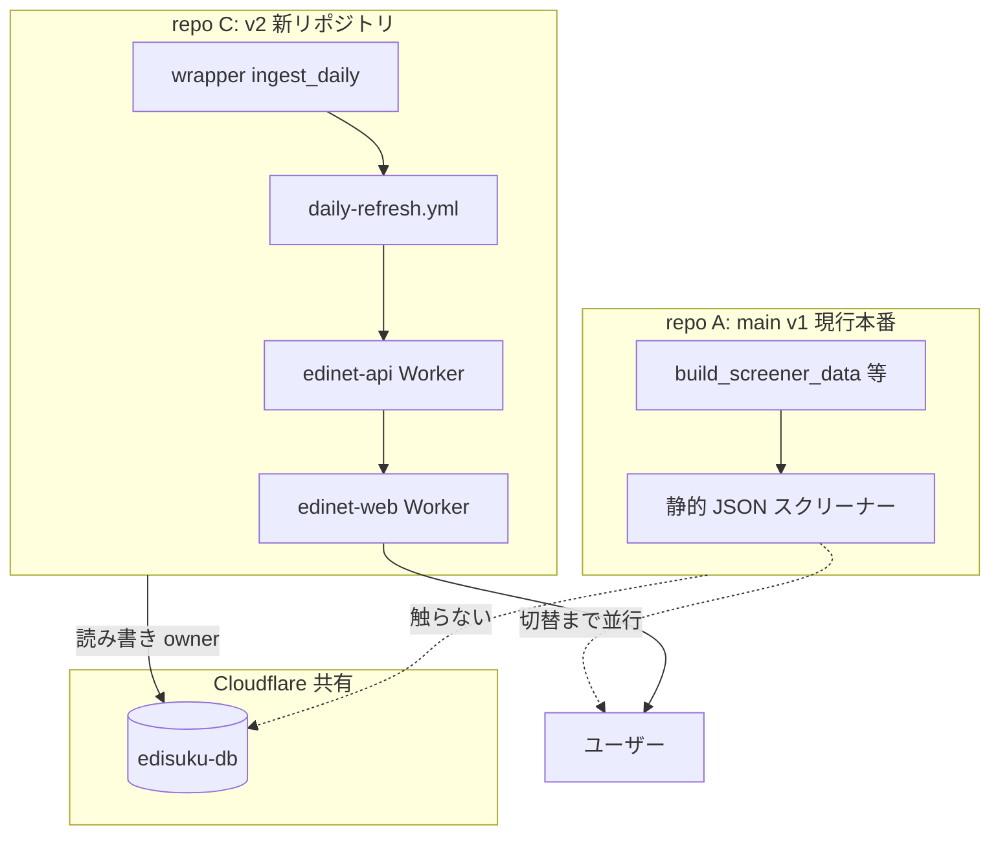

# 残タスクとリポジトリ分離プラン

v2 モノレポ（`feat/v2-monorepo-overhaul`）の完了状況、未着手項目、および **現行 main（v1）リポジトリと切り離しつつ D1 のみ共有** する構成の可否と手順をまとめる。

最終更新: 2026-06-08（本番 `company_metrics` 3922 件投入・Phase 2 検証済み時点）

---

## 1. いまどこまで終わっているか

| 領域 | 状態 | 備考 |
|------|------|------|
| Phase A — `company_metrics` + `packages/metrics` | **完了** | 連続増配・Piotroski の正しい計算含む |
| Phase B — `/api/metrics`、Web 全件ロード、daily-refresh 手順 | **完了** | コード + 本番 D1 データ投入済み |
| Phase C — `/api/metrics/query`、server モード | **完了**（コード） | 本番デプロイ・フラグ切替は未 |
| Phase D — テスト・CI dry-run・ドキュメント一部 | **ほぼ完了** | Playwright smoke 等は未 |
| Phase E — 大株主 API | **コード完了** | 本番データ **0 件** |
| 本番 D1 `company_metrics` | **3922 件** | `edisuku-db` に手動 backfill 済み |
| Phase 2 — local + remote 検証 | **完了** | API `total:3922`、Web プロキシ OK |
| Phase 3 — 本番 Worker デプロイ | **未実施** | 意図的に保留（wrangler deploy は git と別） |
| Git push | **完了** | `a60ffba9` @ `feat/v2-monorepo-overhaul`（wrangler 実体は gitignore） |

---

## 2. まだ終わっていないもの（優先度順）

### P0 — v2 を本番 URL で動かす

| # | タスク | 内容 |
|---|--------|------|
| 1 | **Phase 3 デプロイ** | `pnpm deploy:api:production` / `deploy:web:production`（または `deploy.yml` workflow_dispatch） |
| 2 | **Secrets 整備** | 新リポジトリの GitHub Secrets: `D1_PRODUCTION_ID`, `D1_PRODUCTION_NAME=edisuku-db`, `WORKERS_SUBDOMAIN`, `CLOUDFLARE_*`, `INTERNAL_API_KEY`, `EDINET_API_KEY` |
| 3 | **本番 URL 確認** | workers.dev またはカスタムドメインで `/screener`・analyze |
| 4 | **CORS / BFF** | 本番 Web URL を `CORS_ORIGIN` と web の upstream 設定に反映 |

### P1 — 日次運用を v2 リポジトリに一本化

| # | タスク | 内容 |
|---|--------|------|
| 5 | **daily-refresh を新リポジトリで実行** | `D1_PRODUCTION_NAME=edisuku-db` を Secret に設定（未設定だと `edinet-production` にフォールバックして失敗） |
| 6 | **ingest 配線確認** | `apps/wrapper/scripts/ingest_daily.py` は scaffold（TODO あり）。本番 ingest が v1 側で動いているなら **二重実行を避ける** |
| 7 | **KV（任意）** | `KV_PRODUCTION_ID` 設定後、metrics 全件キャッシュを有効化 |

### P2 — 大株主（Phase E データ）

| # | タスク | 内容 |
|---|--------|------|
| 8 | **main の `shareholders/*.json` 取り込み** | `apps/web/public/data/shareholders/` に配置 |
| 9 | **本番 backfill** | `pnpm db:backfill:shareholders` → `wrangler d1 execute` |
| 10 | **日次自動更新（将来）** | 現状は静的 JSON の再投入のみ。EDINET TSV → `parseShareholders` の ingest 配線は **未実装** |

### P3 — 品質・仕様ギャップ

| # | タスク | 内容 |
|---|--------|------|
| 11 | **`industry` 列** | API が `companies` と JOIN しておらず常に null |
| 12 | **PR 分割・main マージ方針** | 現行 main とは別リポジトリにするなら PR は新 repo 向け |
| 13 | **`metrics.py` deprecate** | TS `packages/metrics` を正とする方針の明文化 |
| 14 | **Playwright smoke（任意）** | `/screener` 数値セル確認 |

---

## 3. リポジトリ分離 — やりたいこと

```
現状:
  repo A (main / v1)  → 静的 JSON スクリーナーが本番稼働
  repo B (v2 branch)  → API + D1 + 新 UI（検証中）

目標:
  repo A              → v1 として当面維持（または凍結）
  repo C (新規)       → v2 モノレポを移住
  Cloudflare D1       → 両方（実質 v2 側）で共有 — edisuku-db のみ正本
```

---

## 4. D1 だけ共有する — 可能か？

### 結論: **可能。ただし「D1 を読む」だけなら簡単、「書く」は一本化が必須。**

Cloudflare では **同一アカウント内の 1 つの D1 データベース**（`database_id`）を、複数 Worker / 複数リポジトリの `wrangler.toml` から同じ ID でバインドできる。

```toml
# 新 v2 リポジトリの apps/api/wrangler.toml（ローカル・gitignore）
[[env.production.d1_databases]]
binding = "EDINET_DB"
database_name = "edisuku-db"
database_id = "c15ad570-7c7a-4152-8303-a3d75360de4c"
```

| パターン | 可否 | 説明 |
|----------|------|------|
| v2 Worker が既存 `edisuku-db` を **読む** | **可能** | 上記 binding のみ。追加 D1 作成不要 |
| v2 が `company_metrics` を **書く** | **可能** | 既に 3922 件投入済み。v1 がこのテーブルを使わなければ競合なし |
| v1（静的 JSON）と **並行稼働** | **可能** | v1 が D1 に触れない限り完全独立 |
| **同一 D1 に v1 と v2 の ingest が両方書く** | **非推奨** | `period_financials` の二重更新・スキーマ競合のリスク |
| **両リポジトリで migration を別々に流す** | **危険** | `0001_company_metrics` 等は **v2 リポジトリ側だけ**が owner |
| v2 だけ daily-refresh + metrics rebuild | **推奨** | 日次の正本パイプラインは 1 系統 |

### 共有してよいもの / 分けるもの

| リソース | 共有 | 分離 |
|----------|------|------|
| **D1 `edisuku-db`** | ○（ID 固定で bind） | — |
| **D1 `edisuku-db-staging`** | ○（検証用） | — |
| **Workers（API / Web）** | — | v2 用に別名デプロイ（例: `edinet-api-v2`） |
| **GitHub repo / Actions** | — | v2 専用リポジトリ + Secrets |
| **KV / R2** | △（同じ ID でも可） | 新規作成した方がトラブル少ない |
| **カスタムドメイン** | — | 切替時に v1 → v2 へ DNS/Worker ルート変更 |
| **ingest（EDINET 取得）** | — | **1 リポジトリ・1 cron に集約** |



---

## 5. リポジトリ分離の手順（推奨）

### Step 1 — 新リポジトリ作成

1. GitHub に新 repo 作成（例: `edinet-v2` または `edisuku-screener`）
2. `feat/v2-monorepo-overhaul` を push（または `git clone --mirror` で移行）

```bash
git remote add v2-origin git@github.com:<org>/<new-repo>.git
git push v2-origin feat/v2-monorepo-overhaul:main
```

3. 旧 repo の `main` は **そのまま**（v1 本番継続）

### Step 2 — Cloudflare（D1 共有設定）

1. **新 D1 は作らない** — 既存 `edisuku-db` の `database_id` を流用
2. 新リポジトリで `infra/setup-fork.sh` を実行する場合も、既存 DB を選択するか、手動で `wrangler.toml` に ID を記載（**git に commit しない**）
3. v2 用 Worker 名を変えて v1 と衝突回避（任意）:
   - `edinet-api` → `edinet-api-v2`（`wrangler.toml` の `name`）
   - `edinet-web` → `edinet-web-v2`

### Step 3 — GitHub Secrets（新リポジトリのみ）

| Secret | 値（例） |
|--------|----------|
| `D1_PRODUCTION_ID` | `c15ad570-7c7a-4152-8303-a3d75360de4c` |
| `D1_PRODUCTION_NAME` | `edisuku-db` |
| `D1_STAGING_ID` | `557093c3-a9c5-420e-8fc2-9e4bc57f36f7` |
| `WORKERS_SUBDOMAIN` | 既存アカウントのサブドメイン |
| `CLOUDFLARE_API_TOKEN` / `CLOUDFLARE_ACCOUNT_ID` | 既存 |
| `INTERNAL_API_KEY` | api / web で同一（`wrangler secret put`） |
| `EDINET_API_KEY` | daily-refresh 用 |

### Step 4 — パイプラインの owner を決める

| 処理 | owner リポジトリ |
|------|------------------|
| EDINET ingest → `period_financials` | **v2 のみ**（v1 の D1 更新を止める） |
| `company_metrics` rebuild | **v2 のみ**（daily-refresh） |
| `shareholder_snapshots` | **v2 のみ**（JSON または将来 TSV） |
| v1 静的 JSON ビルド | **repo A のみ**（切替まで） |

### Step 5 — 検証 → 切替

1. v2 を `*.workers.dev` で Phase 3 デプロイ
2. 動作確認（スクリーナー 3922 社、analyze、CSV）
3. 問題なければカスタムドメインを v1 → v2 Worker に付け替え
4. repo A はアーカイブまたは README で「legacy」と明記

---

## 6. リスクと対策

| リスク | 対策 |
|--------|------|
| 二重 ingest で D1 が壊れる | cron は v2 だけ。v1 側の D1 書き込み workflow を無効化 |
| migration の二重適用 | migration は v2 repo のみ実行。`0001` は既適用済みなら再実行不要 |
| wrangler.toml が git に入る | `.gitignore` 維持 + template のみ commit（現状どおり） |
| daily-refresh が 591MB export で重い | 許容（本番 1 日 1 回）。または将来 delta-only metrics rebuild を検討 |
| 大株主が古いまま | main JSON 取り込み or ingest TSV 配線（別マイルストーン） |
| v1 / v2 で URL が違う | 切替前は workers.dev で並行テスト。ユーザーには v1 URL を継続 |

---

## 7. 残タスク実行チェックリスト（新リポジトリ移行後）

### 即時（P0）

- [ ] 新 repo に `feat/v2-monorepo-overhaul` / `main` を push 済み
- [ ] ローカル `wrangler.toml` に `edisuku-db` production binding
- [ ] `INTERNAL_API_KEY` を api / web Worker に設定
- [ ] `deploy --env production`（API → Web）
- [ ] 本番 URL で `/screener`・`/api/metrics?limit=3`

### 短期（P1）

- [ ] GitHub Secret `D1_PRODUCTION_NAME=edisuku-db`
- [ ] `daily-refresh.yml` を手動実行して metrics 再構築が通るか確認
- [ ] v1 側の D1 書き込み workflow を停止（共有する場合）

### 中期（P2–P3）

- [ ] main から `shareholders/*.json` 取り込み + 本番 backfill
- [ ] `industry` JOIN（必要なら）
- [ ] 株主 TSV の ingest 配線（日次自動更新）
- [ ] ドメイン切替

---

## 8. まとめ

| 質問 | 答え |
|------|------|
| 残タスクは？ | Phase 3 デプロイ、Secrets、daily-refresh owner、大株主データ、軽微な仕様ギャップ |
| 別 repo + D1 共有は可能？ | **可能**。`database_id` で同じ `edisuku-db` に bind |
| 何に注意？ | **D1 への書き込み（ingest / migration / daily-refresh）は v2 側に一本化** |
| v1 main は？ | 静的 JSON のまま並行可能。切替時にドメインだけ v2 に向ける |
| いまのデータは？ | 本番 `company_metrics` 3922 件は既に D1 にあり、v2 Worker をデプロイすれば利用可能 |

次のアクション: **新リポジトリを作成 → ブランチ push → Secrets 設定 → Phase 3 デプロイ**（wrangler 実体はリポジトリに含めない）。
